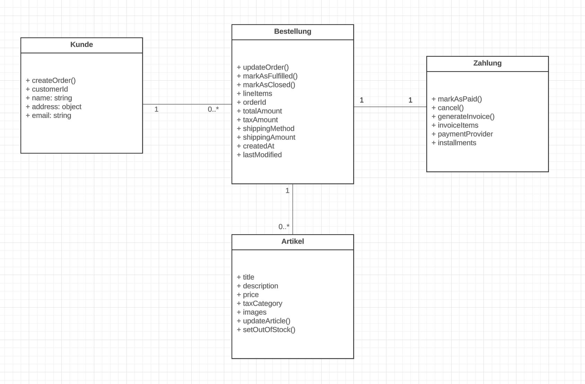
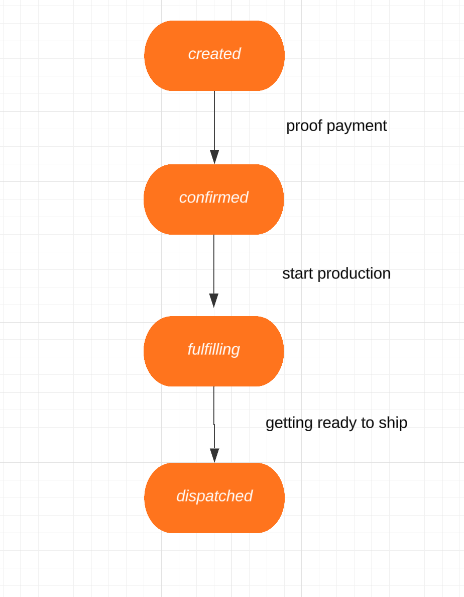
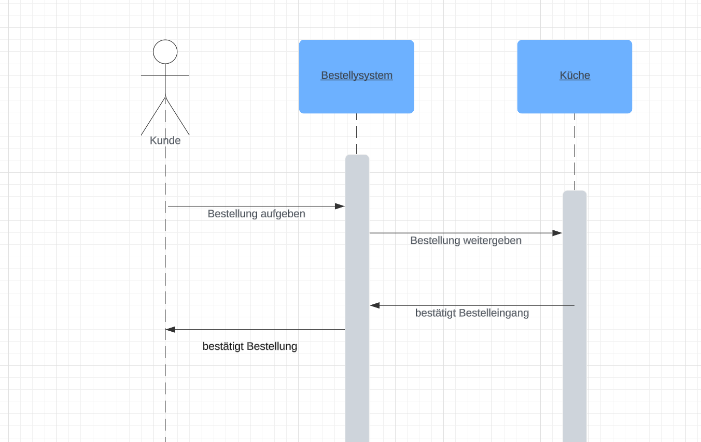

## Teil 1: Klassendiagramm

-   **Aufgabe:**  Entwirf ein Klassendiagramm, das die Hauptkomponenten des Systems darstellt: Kunde, Bestellung, Artikel (z.B. Speisen und Getränke) und Zahlung.
    
-   **Attribute und Methoden:**  Lege für jede Klasse relevante Attribute und Methoden fest. Zum Beispiel könnte die Klasse „Kunde” Attribute wie „Name” und „Adresse” und Methoden wie „Bestellung aufgeben” haben.
    
-   **Beziehungen:**  Zeige die Beziehungen zwischen den Klassen. Ein Kunde könnte mehrere Bestellungen aufgeben, und jede Bestellung könnte mehrere Artikel enthalten.

-   **Meine Lösung:**  

## Teil 2: Zustandsdiagramm

-   **Aufgabe:**  Erstelle ein Zustandsdiagramm für den Lebenszyklus einer „Bestellung”. Berücksichtige Zustände wie „erstellt”, „bestätigt”, „in Zubereitung”, „fertig zur Lieferung” und „geliefert”.
 
    
-   **Übergänge:**  Definiere die Ereignisse, die zu Zustandswechseln führen. Zum Beispiel führt das Ereignis „Bestellung bestätigen” vom Zustand „erstellt” zum Zustand „bestätigt”.

-   **Meine Lösung:**  

## Teil 3: Sequenzdiagramm

-   **Aufgabe:**  Entwickle ein Sequenzdiagramm, das die Interaktion zwischen dem „Kunden”, dem „Bestellsystem” und der „Küche” bei einer Bestellung darstellt.
   
  
-   **Ablauf:**  Stelle die Schritte dar, die von der Bestellungsaufgabe bis zur Bestätigung der Bestellung erfolgen. Dies könnte die Übermittlung der Bestellung vom Kunden an das System, die Überprüfung und Weiterleitung an die Küche und schließlich die Bestätigung der Bestellung an den Kunden umfassen.

-   **Meine Lösung:**  
