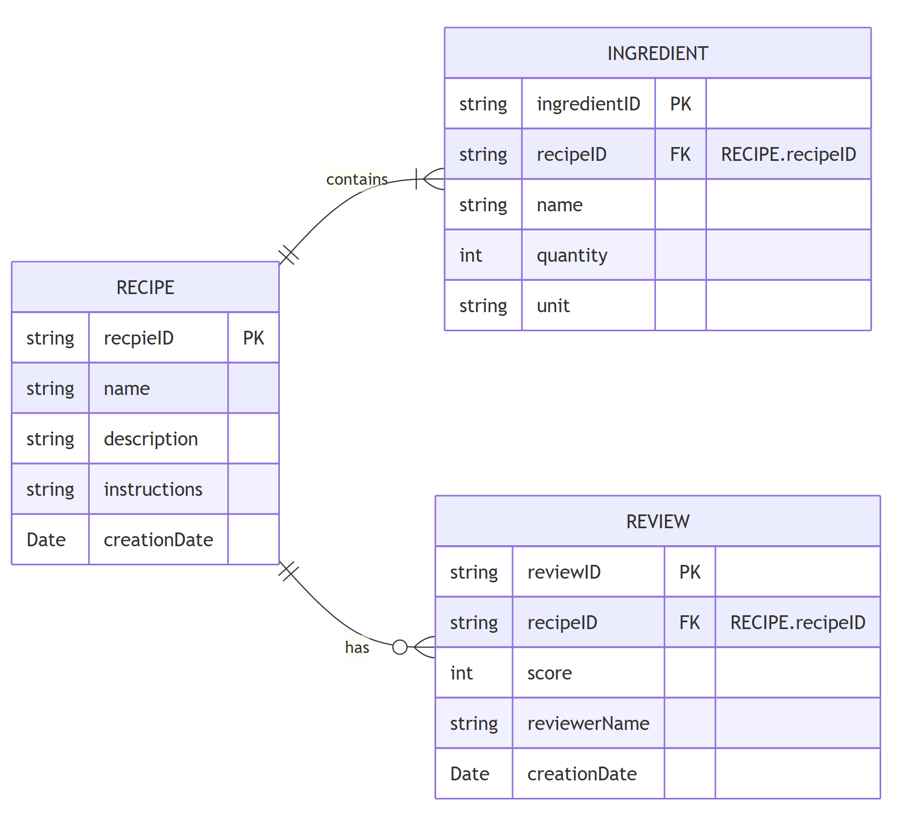

# UE - Database Scheme for Recipes

## Tables
    - RECIPE
    - INGREDIENT
    - REVIEW

## Keys
    - RECIPE
        - recipeID Primary Key
    - INGREDIENT
        - ingredientID Primary Key
        - recipeID Foreign Key, relates to RECIPE.recipeID
    - REVIEW
        - reviewID Primary Key
        - recipeID Foreign Key, relates to RECIPE.recipeID

## Relations
    - RECIPE - INGREDIENT (One to Many, RECIPE.recipeID = INGREDIENT.recipeID)
    - RECIPE - REVIEW (One to Many, RECIPE.recipeID = REVIEW.recipeID)

## Diagram

